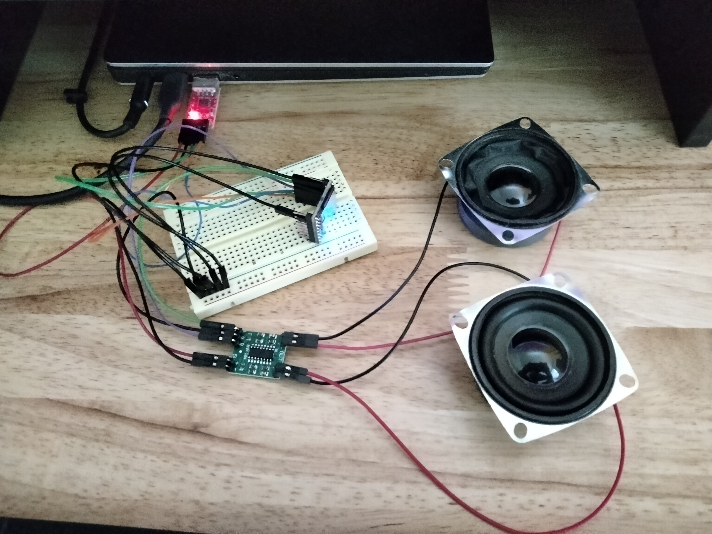

# DFRobot - DFPlayer Mini - Go / TinyGo driver

## Test Requirements

1. Before running the tests, you will need to create a datasource on a SD card, up to 32GB. It's strongly recommended to **erase the SD card** before formatting it with a FAT file system.

2. Create the following root folders on the SD card, respectively named: '01','10','15','advert' and 'mp3'. Each of the following folder should have at least 2 tracks.

    Example test SD card folder and track content:

    1. Folder '01': '001.mp3','003.mp3','005.mp3','007.mp3','009.mp3','002.mp3','004.mp3','006.mp3','008.mp3','010.mp3'

    2. Folder '10': '0001.mp3','3000.mp3'

    3. Folder '15': '001.mp3','002.mp3','003.mp3','004.mp3','005.mp3','006.mp3','007.mp3','008.mp3','009.mp3','010.mp3'

    4. Folder 'advert': '0001.mp3'

    5. Folder 'mp3': '0001.mp3','0002.mp3','0003.mp3','0004.mp3','0005.mp3','0006.mp3','0007.mp3','0008.mp3','0009.mp3','0010.mp3'

    Note: the track numbering scheme **matters** and dictates which playback functions can be used. Please read the chip's datasheet under /docs for more information on file and folder naming conventions.


## Hardware setup requirements:

The MP3 player is controlled over a serial interface and as such, it can be connected to any computer or any MCU. In order to run the tests successfully, you will need the following or equivalent parts:

    . a serial USB to UART adapter capable of supplying 3.3v and 5v.
    . a DFRobot DFPlayer Mini 3.3v powered by the USB to UART adapter 
    . an SD card (up to 32GB)
    . an optional HW-104 amplifier, connected to the MP3 player's DAC pins, 5v powered through the USB UART adapter
    . an optional two speakers, 4 Ohms minimum, up to 6 Watts, connected to the HW-104. If only using a single speaker, simply connect to the built-in amplifier of the MP3 player

The tests are designed to make use of the MP3 player's DAC stereo output through the HW-104 amplifier. Feel free to disable the DAC output in the tests if you use a single speaker using the MP3 player's built-in amplifier instead.
Please refer to the datasheet for wiring details.



## Running the tests:

Before running the tests, please update the 'serialPortPath' constant to reflect the actual serial port connected to the MP3 player.

```
	serialPortPath = "/dev/ttyUSB0"
```

### $ go test -v
```
=== RUN   TestPlayerReset
--- PASS: TestPlayerReset (1.01s)
=== RUN   TestGetSDTrackCount
--- PASS: TestGetSDTrackCount (1.00s)
=== RUN   TestFolderEnumeration
--- PASS: TestFolderEnumeration (9.81s)
=== RUN   TestPlayNextTrack
--- PASS: TestPlayNextTrack (25.47s)
=== RUN   TestPlayFolderTrack
--- PASS: TestPlayFolderTrack (25.28s)
=== RUN   TestPlayAdvertFolderTrack
--- PASS: TestPlayAdvertFolderTrack (28.63s)
=== RUN   TestPlay3KFolderTrack
--- PASS: TestPlay3KFolderTrack (25.47s)
PASS
ok  	github.com/0b1-k/DFPlayerMini	116.675s
```

Note: playback time per track is limited to 20 seconds in each test to ensure that each test completes before for the 30 second default timeout.

You will also find a complete usage examples in the */examples* folder. The player example scans the SD card for numerical folders containing any tracks to playback. Each track is then played sequentially within each folder, after which the example exits.

The example expects the same hardware setup and SD card content as the previous tests.

Note: in the example's output, there are two error messages indicating that a track was not found. These messages are expected due to the tracks numbering scheme used within folder '10', which requires using a *large folder* playback function.

```
$ cd ./examples/dfplayermini/player
$ go build
$ ./player
SD card numerical folders: 03, containing 22 tracks
SD card track #0008 finished playing
SD card track #0007 finished playing
SD card track #0001 finished playing
SD card track #0002 finished playing
SD card track #0009 finished playing
SD card track #0003 finished playing
SD card track #0004 finished playing
SD card track #0005 finished playing
SD card track #0006 finished playing
SD card track #0010 finished playing
!! Specified track is not found
!! Specified track is not found
SD card track #0020 finished playing
SD card track #0019 finished playing
SD card track #0011 finished playing
SD card track #0012 finished playing
SD card track #0013 finished playing
SD card track #0014 finished playing
SD card track #0015 finished playing
SD card track #0016 finished playing
SD card track #0017 finished playing
SD card track #0018 finished playing
```
