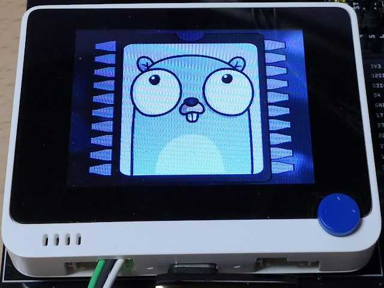

# examples/ili9341/slideshow



This example uses the image package for TinyGo to display png and jpeg images.  

## How to create an image

The following program will output an image binary like the one in [images.go](./images.go).  

```
go run ./examples/ili9341/slideshow/convert2bin ./path/to/png_or_jpg.png
```

## Notes

Displaying a 320x240 png or jpeg often requires more than 50KB of memory.  
The examples include samd21 settings, but if you run them as is, you will get a memory size error.  
